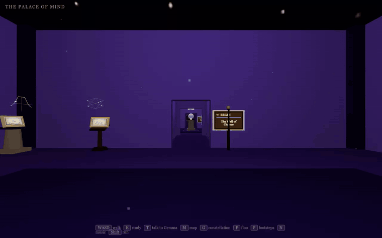
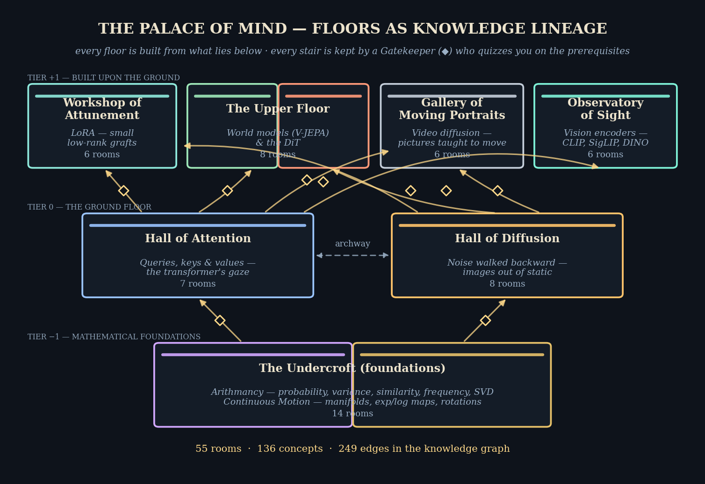
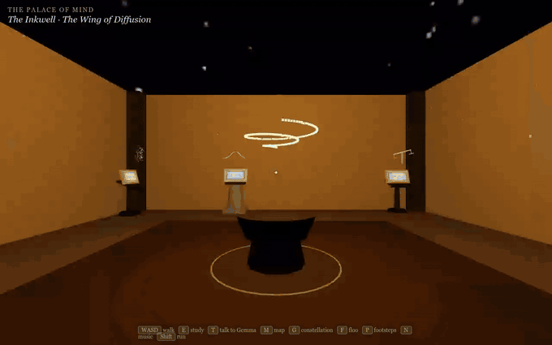
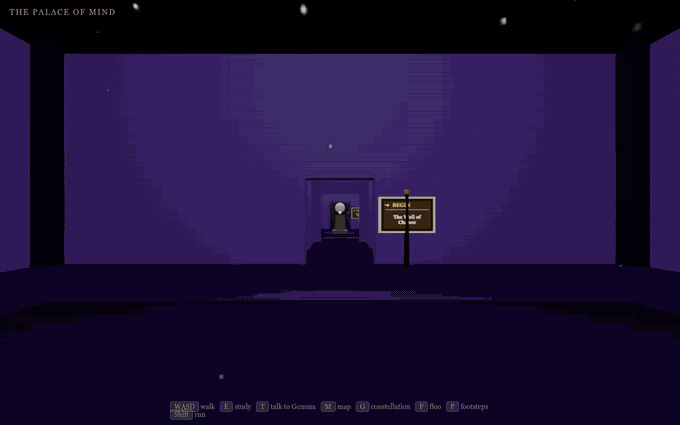
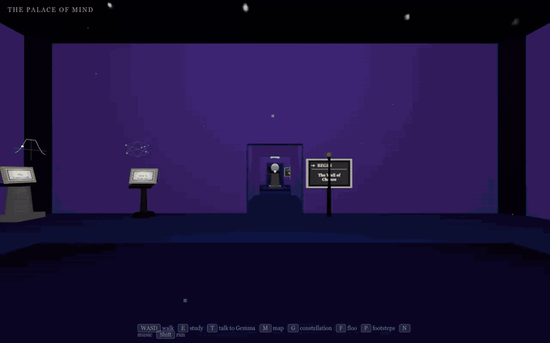
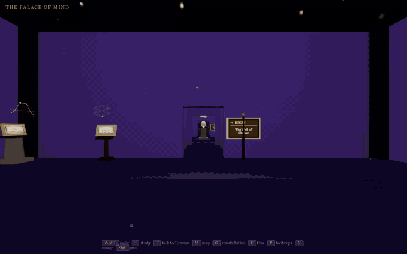
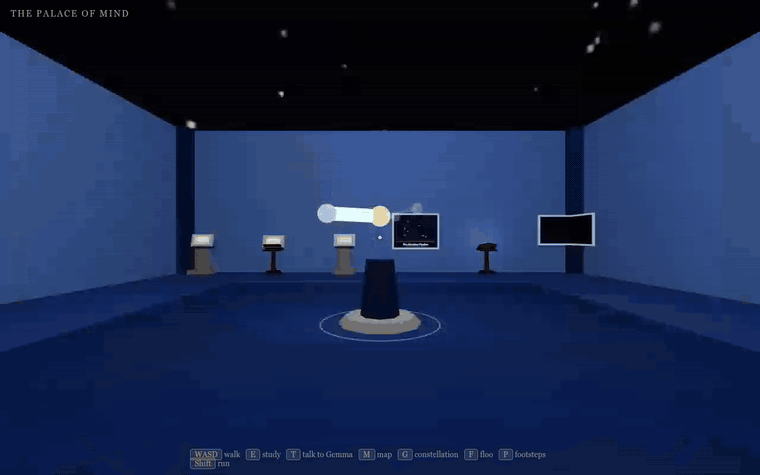

# 🏰 The Palace of Mind

*A walkable, Harry Potter–styled mind palace. Every piece of knowledge you learn becomes
a 3D chamber you can physically walk through.*

<p align="center">
  
</p>

**Walk it now:** the palace is live at
**[singh-sid930.github.io/mind-palace](https://singh-sid930.github.io/mind-palace/)** —
nothing to install. (The Gemma companion stays home; everything else travels.)

Artifacts are working metaphors, plaques carry the distilled mechanics with worked
examples, tomes hold full source texts — and **every text display has a small animated
diagram floating above it**, so the intuition moves even before you read. A knowledge
graph keeps every idea connected to the ideas it builds on: **55 rooms across 7
floors, 136 concepts, 249 typed edges**.

**The core design:** the engine is code, built once; the world is pure data, grown
forever. Any LLM can extend the palace by writing small JSON files against
[WORLD_SPEC.md](WORLD_SPEC.md) and running the validator — no code, no coordinates,
no assets.

## Run it

```bash
cd mind-palace
python serve.py          # → open http://localhost:8777
ollama serve             # optional, powers Gemma & the Gatekeepers (gemma3:27b)
```

| Key | Does |
|---|---|
| **W A S D** + mouse | walk & look (**Shift** to run) |
| **E** | study an exhibit · step through a portal, stair, or signpost |
| **T** | talk to Gemma, the ghost companion |
| **G** | the constellation — a 3D map of every idea on every floor |
| **M** / **F** | this floor's map / floo travel to any chamber by name |
| **P** | toggle the Marauder's footsteps |
| **N** | toggle the procedural score (headphones recommended) |
| **Esc** | close whatever is open |

## A castle built as a lineage

Floors encode *where knowledge comes from*. Mathematical foundations lie in the
basement, the ground floor holds the two great halls built directly on them, and
everything higher is built from what stands below. Stairs follow the lineage — and
every stair is kept by a **Gatekeeper**, a quiz-ghost who asks about the prerequisite
concepts before letting you climb. (You can always answer, skip, or walk away.)

<p align="center">
  
</p>

## Exhibits that move like the mathematics

The palace's centerpiece artifacts are **kinetic**: the animation *is* the mechanism.
A figure dissolves into noise exactly the way forward diffusion destroys an image; the
Orb of Likeness pours real softmax weight onto orbiting keys; a straight tangent arrow
wraps onto a sphere as a geodesic — the exp map, running on a loop.

<p align="center">
  
</p>

And the motion doesn't stop at the centerpieces. **Every plaque, tome, and portrait
carries a floating widget** — one of 22 small parametric animated diagrams drawn from
a shared library (`engine/widgets.js`): softmax bars race and chain to each other, a
causal mask's upper triangle never lights, random draws rain into a bell histogram,
the unit circle rides rotate–stretch–rotate through the SVD, a kernel bracket walks a
signal row, twin beads drift apart where a tangent leaves its curve. Rooms pick a
widget and its parameters in one line of JSON; the concept chooses the motion.

Press **E** at any diagram or figure and it unfolds as a large panel floating in the
room — you keep control, so you can step back, walk around it, and read the study card
alongside.

<p align="center">
  
</p>

## The constellation of ideas

Press **G** anywhere: the palace falls away and the knowledge graph hangs in space —
each floor a layer of stars, each room a star, each concept a mote, every edge a typed
thread (*builds-on*, *part-of*, *relates-to*, *contrasts-with*). Drag to orbit, scroll
to zoom, click a star to travel there.

<p align="center">
  
</p>

## The Marauder's footsteps

Ghostly footprints march ahead of you, always toward the next thing to learn — the
exhibits of a room in study order, then the doorway that continues the wing. Press
**P** to send them away when you'd rather wander (they remember your choice).

<p align="center">
  
</p>

## A castle that lives and sounds

The palace is quietly inhabited. **Ambient events** — a rat scurrying the skirting, a
grey lady drifting through a wall, a dementor that may summon a patronus — fire every
half-minute or so, chosen by where you are and what the room teaches, all defined as
validated data in `world/events.json`. And a **procedural score** (toggle **N**) is
synthesized entirely from formulas in WebAudio: a breathing harmonic drone, distant
golden-ratio FM bells, a pink-noise air bed, a subliminal binaural layer that rotates
calm → focus → alertness, and a distinct distant sting for each of the thirteen event
actors. No audio files anywhere in the repo.

## Gemma, the Whispering Sage

A ghost drifts at your shoulder, backed by a local Ollama service (`gemma3:27b` at
`localhost:11434`; override with `OLLAMA_URL` / `OLLAMA_MODEL`). She knows which room
you're in, which exhibit you're studying, and the concepts anchored there — so *"why
doesn't this collapse?"* needs no setup. She keeps her answers short; ask her to
*"write it down"* or *"give me a scroll"* and the full version is saved as a
parchment-styled **scroll** in `scrolls/` with a 📜 link. The same service voices the
Gatekeepers at the stairs. `serve.py` never starts Ollama itself — it only talks to
the existing service. On the hosted site (no backend) the palace degrades gracefully:
the sage falls silent, the gates open wordlessly, and everything else works.

<p align="center">
  
</p>

## Grow it

Give any capable model this prompt:

> Read WORLD_SPEC.md in ~/workspace/mind-palace and add what I just learned about
> \<topic\> as a new room (or extend an existing wing). Run `python world.py validate`
> until it passes.

The validator (`world.py`) enforces the schema and referential integrity, and
regenerates the engine's load manifest only on success — unvalidated content never
renders. The knowledge graph is authored as one fragment per room, so many rooms
(or many agents) can be written in parallel without touching a shared file.

## Layout

```
index.html          # the game (open via a static server)
WORLD_SPEC.md       # the content contract for models
world.py            # validator CLI: python world.py validate | summary
serve.py            # static server + Gemma/Gatekeeper bridge to Ollama
world/
  world.json        # palace title, levels (floors), wings, passages (stairs/gates)
  rooms/*.json      # one file per room (validated, data-only)
  graph/*.json      # knowledge graph, one fragment per room (concepts + edges)
  events.json       # ambient events (who appears, where, how rarely) — data too
  catalog.json      # single source of truth for every enum (props, palettes, ...)
  schema.json       # JSON Schema (structure only; enums injected from the catalog)
  assets/*.png      # figures referenced by image exhibits
  rooms/index.json  # GENERATED by validate — engine load manifest
  graph.json        # GENERATED by validate — merged graph the engine fetches
engine/             # Three.js renderer — content models never touch this
  layout.js         # deterministic solver: semantics -> geometry (branching wings)
  builder.js        # procedural rooms, walls, doors, pits, lights, sky
  levels.js         # lazy floor loading: build on first visit, LRU-dispose the rest
  props.js          # parametric furniture props (primitives only, zero assets)
  kinetics.js       # animated concept props — the motion is the mechanism
  widgets.js        # floating diagram widgets — 22 parametric animated graphics
  actors.js         # ambient-event creatures (rat, ghosts, dementor, ...)
  events.js         # the ambient-event scheduler (data-driven, one live at a time)
  music.js          # the procedural score — pure WebAudio synthesis, zero assets
  passages.js       # stairs, archways, Gatekeeper spectre, passage signboards
  exhibits.js       # exhibit placement + portals + passage mouths
  constellation.js  # the 3D idea map (G)
  footsteps.js      # the Marauder's guide (P)
  wayfinding.js     # carved signposts derived from layout + graph
  wisp.js           # idle guiding wisp
  player.js         # first-person controls + collision
  hud.js            # focus panels, floor map, floo
  chat.js           # Gemma / Gatekeeper speech-bubble chat
  companion.js      # Gemma's ghost body
  palettes.js       # the named color palettes wings may use
  debug.js          # window.__palace API for headless tooling
  vendor/           # three.js (vendored, no CDN needed to walk around)
tools/              # figure generators + headless capture harness (playwright)
  capture.py        # records the README footage headlessly
  readme_map.py     # regenerates the elevation map from world data
docs/media/         # README gifs + the palace map
```

Diagrams render via Mermaid from CDN when online; offline they fall back to the
diagram source text. Everything else runs fully offline.
